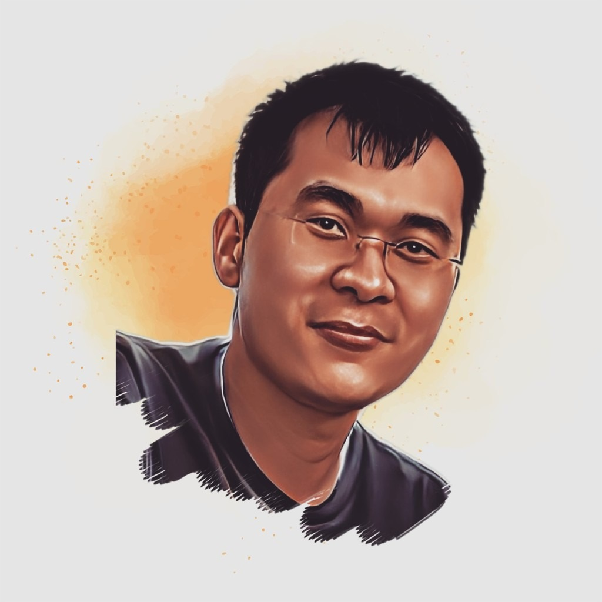

# Fei Zuo, Ph.D.

<table>
<tr>

<td width="700">

 <b> Assistant Professor </b>   

<li>  Email: fzuo (at) uco.edu  </li>
<li>  Office: MCS 130  </li>
<li>  Department of Computer Science  </li>
<li>   University of Central Oklahoma  </li>

  
<a href="https://scholar.google.com/citations?hl=en&user=PCRl368AAAAJ">[Google Scholar]</a>
<a href="https://orcid.org/0000-0001-8902-1753">[ORCID]</a>  

</td>

<td width="200">

</td>
</tr>
</table>

## About

I am an assistant professor at <a href="https://uco.edu/">University of Central Oklahoma</a>. I obtained my Ph.D. degree in the department of computer science and engineering at University of South Carolina. 
 
I also serve as the Graduate Program Advisor at the department of computer science. The major responsibility of this role is to assist graduate students with their study plan and enrollment needs throughout their college journey.  
 
My main research interest is <b>System and Software Security</b>, with a focus on data-driven binary analysis, Internet of Things, and mobile computing. I also work on adversarial machine learning. 

## News and Ads

Our department has created a strong hands-on cybersecurity program. Please find more information <a href="https://uco-cyber.github.io/education/">here</a>.

## Recent Publication

- D-Score: A White-Box Diagnosis Score for CNNs Based on Mutation Operators (ADMA 2023)
- ProvSec: Cybersecurity System Provenance Analysis Benchmark Dataset (SERA 2023)
- Commit Message Can Help: Security Patch Detection in Open Source Software via Transformer (SERA 2023)
- Use It-No Need to Shake It! Accurate Implicit Authentication for Everyday Objects with Smart Sensing (UbiComp 2022)
- <a href="/research/">... More ...</a>

## Teaching

- <a href="/teaching/#OS">CMSC4153/5053: Operating Systems</a>, Fall/Spring semester

- <a href="/teaching/#SSA">CMSC4163/5163: Secure System Administration and Certification</a>, Fall sememster

- <a href="/teaching/#DS">CMSC3613: Data Structures and Algorithms</a>, Spring sememster

## Service

- Graduate program advisor at the department of computer science (08/2023 - )

- Curriculum committee at the college of mathematics and science (01/2023 - 12/2023)

- Research mentor of Fulbright scholar program (05/2022 - 08/2022)

- <a href="/service/">... More ...</a>
