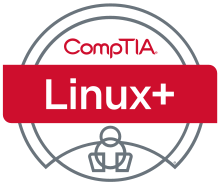

# Teaching

- <h4 id="SSA">CMSC4163/5163: Secure System Administration</h4>

 &nbsp; &nbsp; &nbsp; &nbsp; 2022F; 2023F; 2024F

 &nbsp; &nbsp; &nbsp; &nbsp; This class covers materials for CompTIA Linux+ Certificate, and partially covers Security+ Certificate. 

 </img>  </img>

- <h4 id="OS">CMSC4153/5053: Operating Systems</h4>

 &nbsp; &nbsp; &nbsp; &nbsp; 2022S; 2022F; 2023S; 2023F; 2024S; 2024F 

- <h4 id="DS">CMSC3613: Algorithms & Advanced Data Structures</h4>

 &nbsp; &nbsp; &nbsp; &nbsp; 2023S; 2024S 

- <h4 id="P1">CMSC1613: Programming I</h4>

 &nbsp; &nbsp; &nbsp; &nbsp; 2022S; 2022F; 2023S 

- <h4 id="SDD">CMSC4513/SE4513: Software Design & Development</h4>

 &nbsp; &nbsp; &nbsp; &nbsp; 2022S

